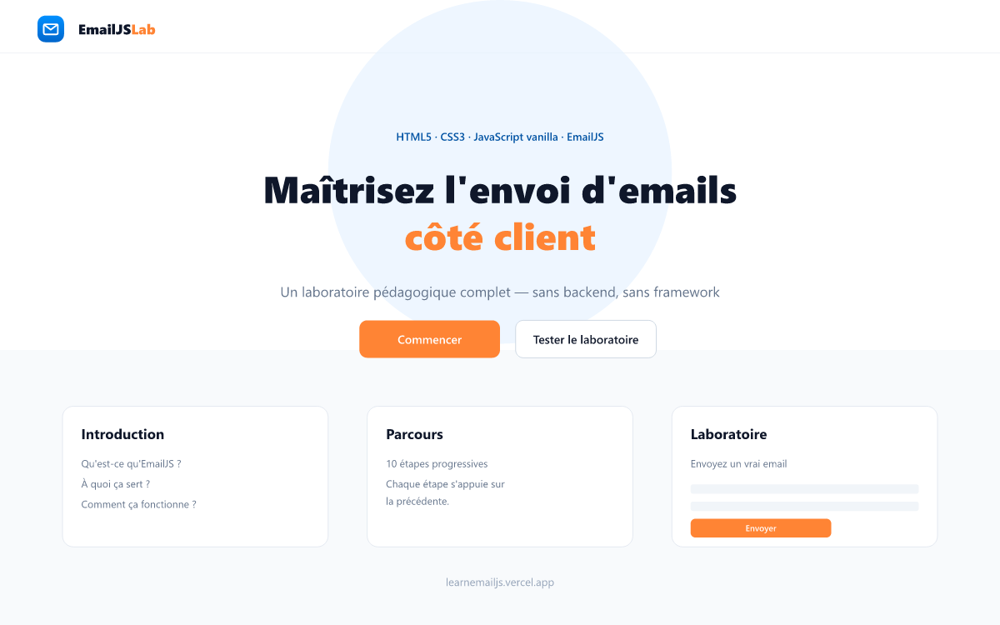

# 📬 EmailJS Lab

> Laboratoire pédagogique interactif pour apprendre à envoyer des emails côté client avec **EmailJS** — sans backend.

[](https://learnemailjs.vercel.app)
[](LICENSE)
[](.)
[](.)

---

## ✨ Aperçu



---

## 🎯 Objectifs pédagogiques

- Comprendre l'architecture EmailJS (Service / Template / Public Key)
- Configurer un service email sans backend
- Envoyer un email depuis un formulaire HTML
- Gérer les erreurs les plus fréquentes
- Sécuriser l'envoi (rate limiting, validation)

---

## 🚀 Démo en ligne

👉 **[https://learnemailjs.vercel.app](https://learnemailjs.vercel.app)**

---

## 🛠️ Stack technique

| Technologie                 | Usage                               |
| --------------------------- | ----------------------------------- |
| HTML5 sémantique            | Structure accessible                |
| CSS3 moderne                | Variables, Grid, thème clair/sombre |
| JavaScript vanilla (ES2022) | Modules, async/await, localStorage  |
| EmailJS v4                  | Envoi d'emails côté client          |

---

## 📂 Structure du projet

```text
learn_email_js/
├── index.html              # Structure HTML5 principale (UI multilingue)
├── manifest.webmanifest    # Configuration PWA
├── sw.js                   # Service Worker (Gestion du cache offline & CDN)
├── robots.txt              # Configuration SEO pour les moteurs de recherche
├── sitemap.xml             # Plan du site pour l'indexation
├── assets/                 # Icônes de l'application et preview
├── css/
│   └── style.css           # Design global, Grid, Flexbox et Thèmes
└── js/
    ├── app.js              # Point d'entrée et initialisation globale
    ├── i18n.js             # Gestion du multilingue (FR/EN)
    ├── playground.js       # Logique du formulaire et envoi EmailJS v4
    ├── history.js          # Gestion des 10 derniers envois (localStorage)
    ├── quiz.js             # Système interactif d'évaluation
    └── sw-register.js      # Enregistrement sécurisé du Service Worker
```
